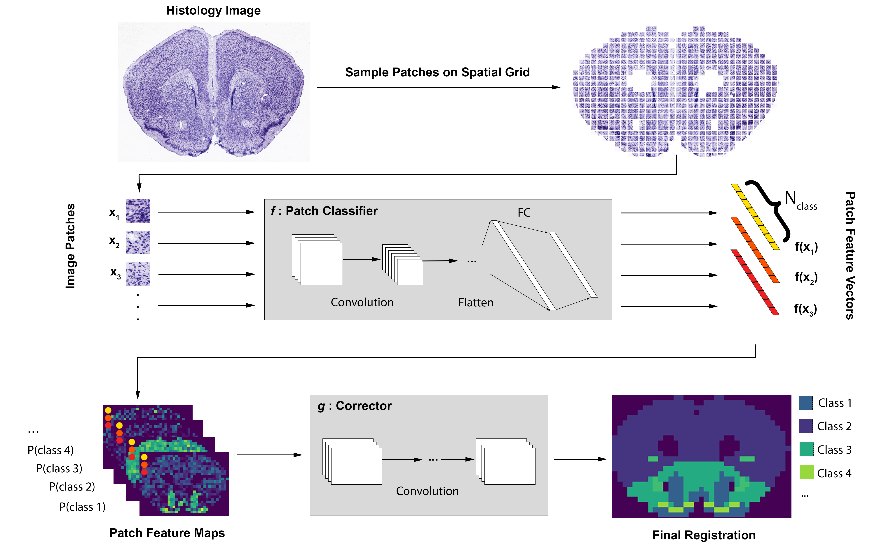

# GridNet: A convolutional neural network for common coordinate registration of high-resolution histopathology images

## Introduction
This is a Python implementation of the model described in our publication [A convolutional neural network for common-coordinate registration of high-resolution histology images](https://www.biorxiv.org/content/10.1101/2020.09.18.303875v1) which was developed principally for applications to registration of data collected during solid-phase capture spatial transcriptomics (ST) experiments. Registration in this context involves assigning tissue type to discrete regions of interest across large histology images, which in the case of spatial transcriptomics assays can be the locations of mRNA capture spots, in order to enable quantitative comparison of transcriptomic measurements gathered in similar regions across disparate tissue. This implementation allows users to either apply a pre-trained model to data from ST or Visium experiments, or to train their own models from manually annotated image data. 

For each tissue of interest, GridNet expects the following information:
* Whole-slide image file
* Locations of foreground (tissue-containing) spots in ST grid
* Class assignments for each foreground spot (if training a new model)



## Prerequisites
* Python (3.7)
* PyTorch (1.4.0)
* torchvision (0.5.0)
* NumPy (1.16.4)
* Pillow (6.0.0)
* pandas (0.24.2)
* sklearn (0.22.2)
* matplotlib (3.1.0)
* HexagDLy (https://github.com/ai4iacts/hexagdly)

## Running the code

### Generating training data

At a low level, training data are expected to be provided in two directories with the following structure:
```
data
|___imgs
|   |___tissue1
|   |   |   1_2.jpg
|   |   |   1_4.jpg
|   |   |   ...
|   |  
|   |___tissue2
|   |   |   1_2.jpg
|   |   |   2_2.jpg
|   |   |   ...
|   |
|   |___...
|  
|___lbls
    |   tissue1.png
    |   tissue2.png
    |   ...
```
For each tissue in the training set, there should exist a sub-directory within the ```imgs``` directory that contains extracted patch images, and an identically-named PNG file in the ```lbls``` directory that contains label information. The label image should have dimensions equal to the dimensions of the ST array (33x35 for standard ST, 64x78 for Visium). All pixels in the label image should contain an integer value between 0 and N_class, with 0 pixels indicating that the corresponding spot belongs to the slide background and nonzero pixels indicating the class label for the corresponding spot. For each foreground spot location (xind,yind), there should exist a correpsonding patch image file within the relevant sub-directory of ```imgs``` named according to ```xind_yind.jpg```.

In order to simplify the processing of inputs to GridNet, we have provided modules that generate these directories from either Cartesian ST or Visium ST output files.

#### Cartesian ST

For data obtained from Cartesian ST experiments, we have provided functionality to generate GridNet training data from files of the format employed by Maniatis et al. [[1]](#1). Briefly, for each tissue image, annotation data should be provided in a tab-separated value (TSV) file of the following format:

|        | x0_y0 | x1_y1 | ...  | xN_yN |
| ------ | ----- | ----- | ---- | ------|
| Class1 | 0     | 1     | ...  | 0     |
| Class2 | 1     | 0     | ...  | 1     |
| ...    | ...   | ...   | ...  | ...   |
| ClassK | 0     | 0     | ...  | 0     |

where column names indicate the indices of foreground (tissue-containing) spots in the ST array, and the column vectors are one-hot encoded to indicate the class membership of each spot.

The module ```create_dataset.py``` provides command-line functionality for generating training data:

```bash
python create_dataset.py -o [OUTPUT_DIR] -i [tissue1.tif ... tissueN.tif] -a [tissue1_annot.tsv ... tissueN_annot.tsv] [-p [PATCH_SIZE]]
```

Note: in order to map between coordinates in the ST array and pixel locations in the image, we assume that images for Cartestian ST experiments have been cropped such that the four corners of the tissue image correspond to the centroids of the four corner spots in the array. The center-center distance for an image with long dimension 6200 pixels should be specified with the ```-d``` argument.

#### Visium ST

For data obtained from Visium ST experiments, we have provided a module, ```visium_gridnet.py``` that interfaces directly with the outputs from 10x Genomics' [SpaceRanger](https://support.10xgenomics.com/spatial-gene-expression/software/pipelines/latest/output/images) and [Loupe](https://support.10xgenomics.com/single-cell-gene-expression/software/visualization/latest/tutorial-interoperability). As with the Cartesian ST data, we have provided command-line functionality for generating a training set using the ```create_dataset.py``` module:

```bash
python create_dataset.py -o [OUTPUT_DIR] -i [tissue1.tif ... tissueN.tif] -a [tissue1_loupe.csv ... tissueN_loupe.csv] -t [tissue1_positions_list.csv ... tissueN_positions_list.csv] [-c [class1 ... classK]] [-p [PATCH_SIZE]] [-d [CENTER_CENTER_DIST]]
```

where annotation files (tissueX_loupe.csv) are in the format exported by Loupe Browser and tissueX_positions_list.csv are in the format exported by SpaceRanger.

Note: Visium ST arrays are indexed in an "odd-right" fashion, where every other row is implicitly shifted right, in order to represent hexagonally-packed data with integer indexing. The HexagDLy package, which is used to perform convolutions over hexagonally packed grids in GridNet, requires input to be represented in an "odd-down" fashion, where every other *column* is implicitly shifted down. In order to reconcile this, the ```visium_gridnet``` module rotates input arrays by 90 degrees when generating inputs for GridNet. The command-line functionality of the same module, discussed [later](#predicting-on-new-data), handles this rotation for the user and outputs labels that match the original indexing scheme.

### Training a model

We provide a Jupyter notebook, ```gridnet_training_example.ipynb```, that details the process by which you may go about training a GridNet model. Additionally, all scripts used to generate the models and figures in our publication are included in ```publication/scripts```.

### Predicting on new data

We have provided command-line functionality for generating patch annotation predictions on new Visium image data using a saved ```GridNetHex``` model:

```bash
python visium_gridnet.py -m [PATH_TO_MODELFILE] -i [PATH_TO_IMAGEFILE] -t [PATH_TO_TISSUE_POSITION_LISTFILE] -c [class1 ... classK] [-a [ANNOT_FILE_DEST]]
```
where the model file contains the state dict of the ```GridNetHex``` model saved with `torch.save(model.state_dict(), model_file)`. We have provided an example of file for a model trained on the 12-array Maynard dataset in ```data/trained_models/gnethex_maynard.pth```, which predicts one of seven annotations for patches of human dorsolateral prefrontal cortex tissue (Layer1, Layer2, Layer3, Layer4, Layer5, Layer6, WM). 
Annotation files are output as CSV files that are compatible with Loupe, thus allowing users to load the predicted annotations into the Loupe browser for visualization and manual correction (see "Categories" section of the [Loupe documentation](https://support.10xgenomics.com/single-cell-gene-expression/software/visualization/latest/tutorial-interoperability) for further details on importing and exporting of spot labels).

## Citation

If you found this repository useful, please cite us!

**A convolutional neural network for common coordinate regustration of high-resolution histology images**\
Aidan C. Daly, Krzysztof J. Geras, Richard A. Bonneau.\
Manuscript in submission\
2020

    @article {Daly2020.09.18.303875,
        author = {Daly, Aidan C and Geras, Krzysztof J and Bonneau, Richard A},
        title = {A convolutional neural network for common coordinate registration of high-resolution histology images},
        elocation-id = {2020.09.18.303875},
        year = {2020},
        doi = {10.1101/2020.09.18.303875},
        publisher = {Cold Spring Harbor Laboratory},
        URL = {https://www.biorxiv.org/content/early/2020/09/20/2020.09.18.303875},
        eprint = {https://www.biorxiv.org/content/early/2020/09/20/2020.09.18.303875.full.pdf},
        journal = {bioRxiv}
    }

## References

<a id="1">[1]</a> 
Maniatis, S., Aijo, T., Vickovic, S., Braine, C., Kang, K., Mollbrink, A., Fagegaltier, D., Andrusivova, Z., Saarenpaa, S., Saiz-Castro, G., Cuevas, M., Watters, A., Lundeberg, J., Bonneau, R., Phatnani, H. (2019). 
Spatiotemporal dynamics of molecular pathology in amyotrophic lateral sclerosis. 
Science, 364(6435), 89-93.
doi:10.1126/science.aav9776
